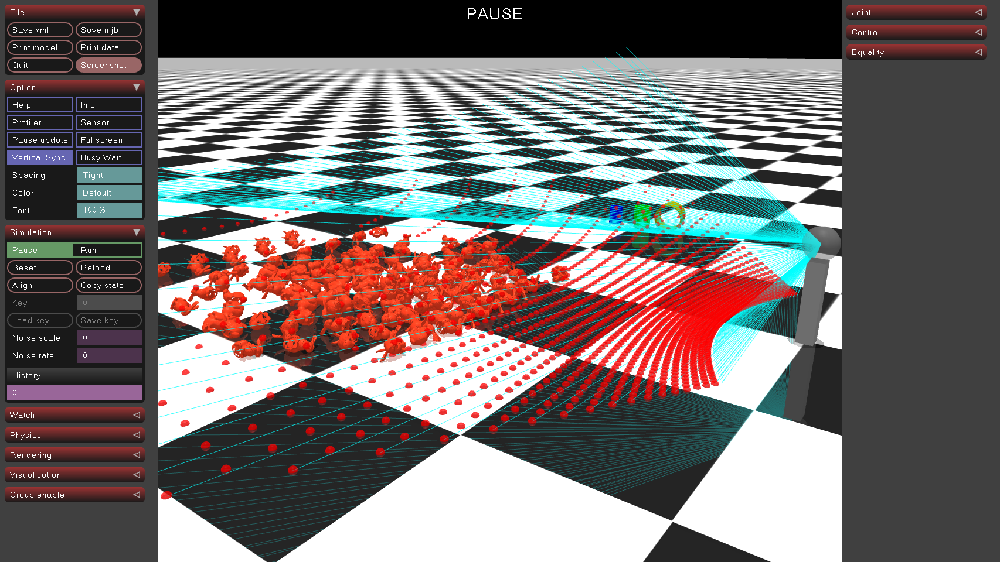
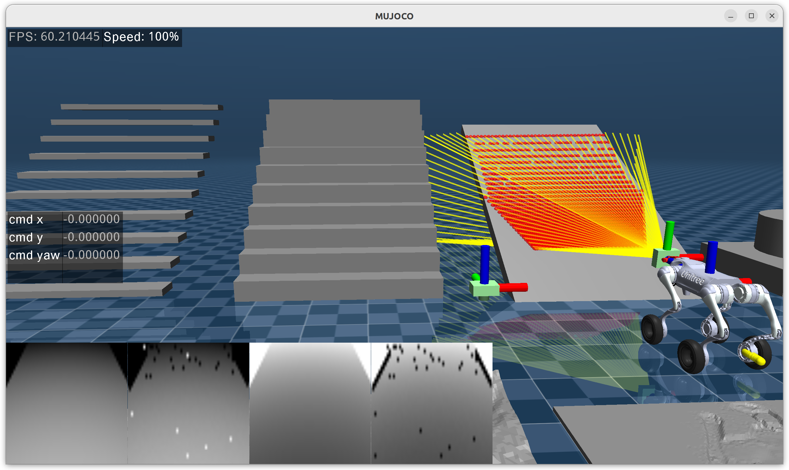

**Languages:** 
[English](README.md) | [简体中文](README.zh-CN.md)

# Sensor RayCaster Plugins
Raycaster sensor plugins bound to a camera, implemented based on `mj_ray`. The raycaster parameters are designed to be as close as possible to Isaac Lab.

The `raycaster_src` can access the C++ API directly. [Reference](https://github.com/Albusgive/go2w_sim2sim)         
[📺 Video Demo](https://www.bilibili.com/video/BV1SSe1zLEVf/?spm_id_from=333.1387.homepage.video_card.click&vd_source=71e0e4952bb37bdc39eaabd9c08be754)    
[🤖 Plugin Function Demo](https://www.bilibili.com/video/BV1wYnvzgExg/?spm_id_from=333.1387.homepage.video_card.click&vd_source=71e0e4952bb37bdc39eaabd9c08be754)

## sensors
mujoco.sensor.ray_caster            

mujoco.sensor.ray_caster_camera          
 
mujoco.sensor.ray_caster_lidar          
    

# Build
**Note:** The cloned MuJoCo version must match the version you intend to use.

`git clone https://github.com/google-deepmind/mujoco.git`   
`cd mujoco/plugin`      
`git clone https://github.com/Albusgive/mujoco_ray_caster.git`  
`sudo apt-get install libeigen3-dev`   
`cd ..`     

Modify `CMakeLists.txt` in the mujoco directory:
```cmake
add_subdirectory(plugin/elasticity)
add_subdirectory(plugin/actuator)
add_subdirectory(plugin/sensor)
add_subdirectory(plugin/sdf)
# Add new path
add_subdirectory(plugin/mujoco_ray_caster)
```

`mkdir build`       
`cd build`      
`cmake ..`      
`cmake --build . # For multi-threaded compilation use: cmake --build . -j<num_threads>`   
`cd bin`        
`mkdir mujoco_plugin`   
`cp ../lib/*.so ./mujoco_plugin/`   

test1:      
`./simulate ../../plugin/mujoco_ray_caster/model/ray_caster.xml`        
test2:      
`./simulate ../../plugin/mujoco_ray_caster/model/ray_caster2.xml`


# MJCF
## base config

### SensorData
**sensor_data_types: string list(n)**   
Construct data modes via underscores. The value is an array of strings of arbitrary length. These data will be concatenated into `mjData.sensordata` in order.

data_type:  
&emsp;`data`: Distance (meters).     
&emsp;`image`: Image data [0, 255] (scaled to `dis_range`). If noise is enabled, you can choose to read the source image or the noise image.   
&emsp;`normal`: Normalized data [0, 1] (scaled to `dis_range`), same as above.      
&emsp;`pos_w`: Ray hit point in the World coordinate system. Returns NAN if missed or out of range.       
&emsp;`pos_b`: Ray hit point in the Sensor coordinate system. Returns NAN if missed or out of range.     
&emsp;`inv`: Inverted data.      
&emsp;`inf_zero`: If the ray detects nothing, return 0. If not enabled, it defaults to `inf_max`.     
&emsp;`noise`: Whether the data contains noise.        
&emsp;`distance_to_image_plane`: Planar distance.       
&emsp;`image_plane_image`: Image based on planar distance.     
&emsp;`image_plane_normal`: Normalized planar distance.        

| cfg \ data_type | data | image | normal | distance_to_image_plane | image_plane_image | image_plane_normal | pos_w | pos_b |
|-----------------|------|-------|--------|-------------------------|-------------------|---------------------|-------|-------|
| inv             | ✘    | ✔     | ✔      | ✘                       | ✔                 | ✔                   | ✘     | ✘     |
| inf_zero        | ✔    | ✔     | ✔      | ✔                       | ✔                 | ✔                   | ✘     | ✘     |
| noise           | ✔    | ✔     | ✔      | ✔                       | ✔                 | ✔                   | ✘     | ✘     |


example: 
```XML
<config key="sensor_data_types" value="data data_noise data_inf_zero inv_image_inf_zero noise_image pos_w pos_b normal inv_normal" />
```

**dis_range: real(6), "1 1 1 0 0 0"**     
&emsp;Measurement range.

**geomgroup: real(6), "1 1 1 0 0 0"**     
&emsp;Which geometry groups to detect.

**detect_parentbody: real(1), "0"**     
&emsp;Whether to detect the sensor's parent body.

### VisVisualize
**draw_deep_ray: real(7), "1 5 0 1 0 0.5 1"**     
&emsp;Draw rays: ratio, width, r, g, b, a, edge.

**draw_deep_ray_ids: real(6+n), "1 5 1 1 0 0.5 list"**     
&emsp;Draw rays with specific IDs: ratio, width, r, g, b, a, id_list.

**draw_deep: real(6), "1 5 0 0 1 0.5"**     
&emsp;Draw depth measurement rays: ratio, width, r, g, b, a.

**draw_hip_point: real(6), "1 0.02 1 0 0 0.5"**     
&emsp;Draw ray hit points: ratio, point_size, r, g, b, a.


example:
```XML
<config key="draw_deep_ray" value="1 5 0 1 1 0.5 1" />
<config key="draw_deep_ray_ids" value="1 10 1 0 0 0.5 1 2 3 4 5 30" />
<config key="draw_deep" value="1 5 0 1 0" />
<config key="draw_hip_point" value="1 0.02" />
```

### Noise
**noise_type: [uniform, gaussian, noise1, noise2]**     
&emsp;Type of noise.

**noise_cfg: n**     
|noise_type|noise_cfg|
|-|-|
|uniform|low high seed|
|gaussian|mean std seed|
|noise1|low high zero_probability seed|
|noise2|low high zero_probability min_angle max_angle low_probability high_probability seed|

#### noise1
Adds random zeroing (dropout) on top of mean noise.

#### noise2
Noise2 is based on the approximate ray incidence angle. Building on noise1, the probability of the data being 0 ranges from `[low_probability, high_probability]` as the incidence angle goes from `min_angle` to `max_angle` (typically [90, 180] degrees).

<div align="center">





</div>


### Other
**compute_time_log: real(1), "0"**     
&emsp;Print computation time.

**n_step_update: real(1), "1"**     
&emsp;Calculate every n steps.

**num_thread: real(1), "0"**     
&emsp;Use n additional threads to calculate rays to improve performance. When using this parameter with many threads, you may need to restart the program every time.

## RayCaster
**resolution: real(1), "0"**     
&emsp;Resolution.

**size: real(2), "0 0"**     
&emsp;Size (meters).

**type: [base, yaw, world]**     
&emsp;`base`: Camera lookat in local frame.
&emsp;`yaw`: Local frame yaw, World Z down.
&emsp;`world`: World frame Z down.


## RayCasterCamera
**focal_length: real(1), "0"**     
&emsp;Focal length (cm).

**horizontal_aperture: real(1), "0"**     
&emsp;Horizontal aperture size (cm).

**vertical_aperture: real(1), "0"**     
&emsp;Vertical aperture size (cm).

**size: real(2), "0 0"**     
&emsp;`h_ray_num`, `v_ray_num`.

**baseline: real(1), "0"**     
&emsp;If it is a stereo depth camera, you need to set the baseline, which is the distance between the two cameras.


## RayCasterLidar
**fov_h: real(1), "0"**     
&emsp;Horizontal FOV (degrees).

**fov_v: real(1), "0"**     
&emsp;Vertical FOV (degrees).

**size: real(2), "0 0"**     
&emsp;`h_ray_num`, `v_ray_num`.


# GetData
The demo provides examples for reading data.          
`mjData.sensordata` contains all the data.     
`mjData.plugin_state` stores data info: `h_ray_num`, `v_ray_num`, `list[data_point, data_size]`.
`data_point` is the data position relative to the total data of this sensor.

example:    
**C++:**
```C++
std::tuple<int, int, std::vector<std::pair<int, int>>>
get_ray_caster_info(const mjModel *model, mjData *d,
                    const std::string &sensor_name) {
  std::vector<std::pair<int, int>> data_ps;
  int sensor_id = mj_name2id(m, mjOBJ_SENSOR, sensor_name.c_str());
  if (sensor_id == -1) {
    std::cout << "no found sensor" << std::endl;
    return std::make_tuple(0, 0, data_ps);
  }
  int sensor_plugin_id = m->sensor_plugin[sensor_id];
  int state_idx = m->plugin_stateadr[sensor_plugin_id];

  for (int i = state_idx + 2;
       i < state_idx + m->plugin_statenum[sensor_plugin_id]; i += 2) {
    data_ps.emplace_back(d->plugin_state[i], d->plugin_state[i + 1]);
  }
  int h_ray_num = d->plugin_state[state_idx + 0];
  int v_ray_num = d->plugin_state[state_idx + 1];
  return std::make_tuple(h_ray_num, v_ray_num, data_ps);
}
```
**Python:**
```Python
def get_ray_caster_info(model: mujoco.MjModel, data: mujoco.MjData, sensor_name: str):
    data_ps = []
    sensor_id = mujoco.mj_name2id(model, mujoco.mjtObj.mjOBJ_SENSOR, sensor_name)
    if sensor_id == -1:
        print("Sensor not found")
        return 0, 0, data_ps
    sensor_plugin_id = model.sensor_plugin[sensor_id]
    state_idx = model.plugin_stateadr[sensor_plugin_id]
    state_num = model.plugin_statenum[sensor_plugin_id]
    for i in range(state_idx + 2, state_idx + state_num, 2):
        if i + 1 < len(data.plugin_state):
            data_ps.append((int(data.plugin_state[i]), int(data.plugin_state[i + 1])))
    h_ray_num = (
        int(data.plugin_state[state_idx]) if state_idx < len(data.plugin_state) else 0
    )
    v_ray_num = (
        int(data.plugin_state[state_idx + 1])
        if state_idx + 1 < len(data.plugin_state)
        else 0
    )
    return h_ray_num, v_ray_num, data_ps
```
# Demo
## C++
```bash
cd demo/C++
mkdir build
cd build
cmake ..
make
./sensor_data
```
## Python
```bash
cd demo/Python
python3 sensor_data_viewer.py
python3 view_launch.py
```
## ROS2
**Note:** You need to install `cyclonedds-cpp`. Using `fastdds` will result in bugs.
```bash
sudo apt update
sudo apt install ros-<distro>-rmw-cyclonedds-cpp
export RMW_IMPLEMENTATION=rmw_cyclonedds_cpp
```
### C++ & cmake
```bash
cd demo/ROS2/C++
mkdir build
cd build
cmake ..
make
./sensor_data
```
### C++ & colcon
```bash
cd demo/ROS2/colcon
colcon build
source install/setup.bash
ros2 run ray_caster sensor_data
```
# Contact

