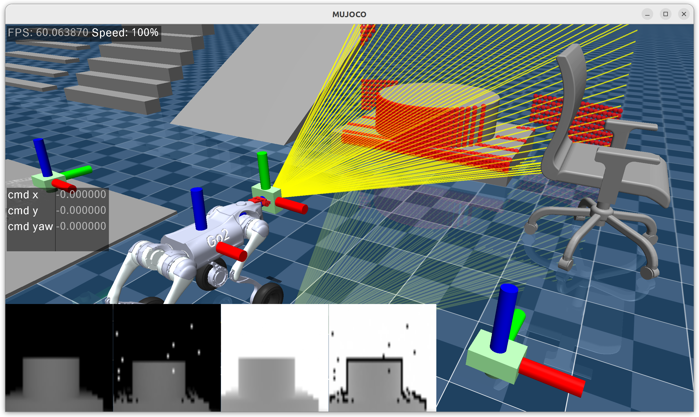
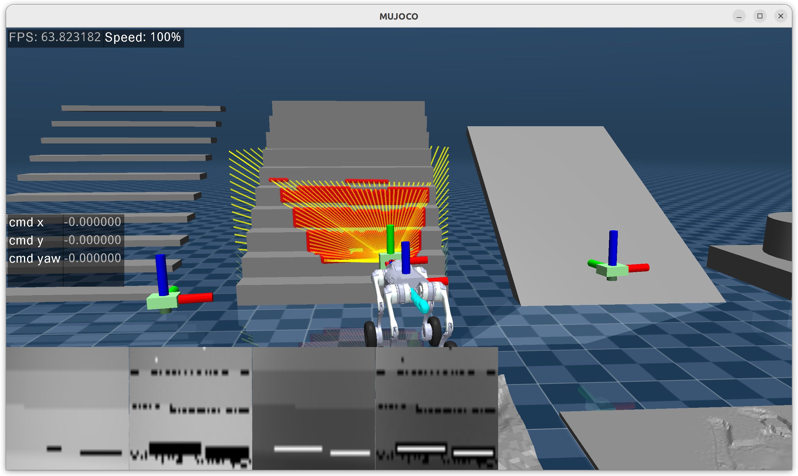
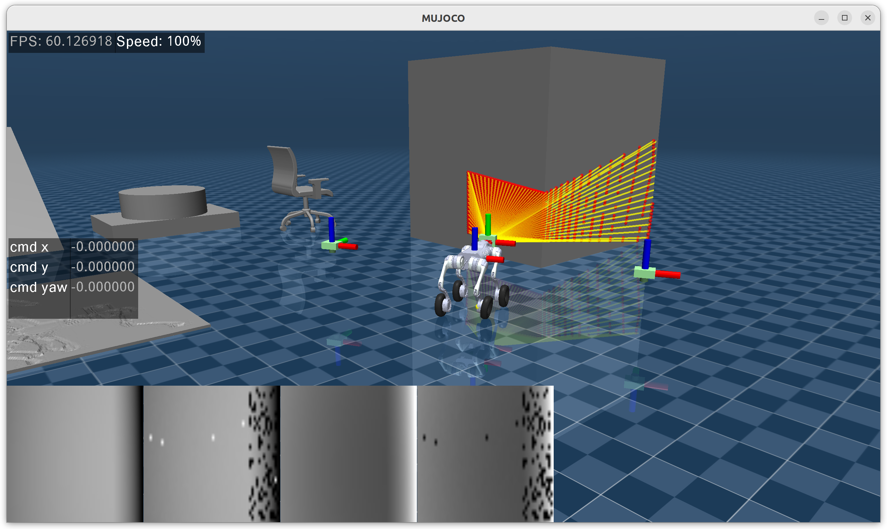
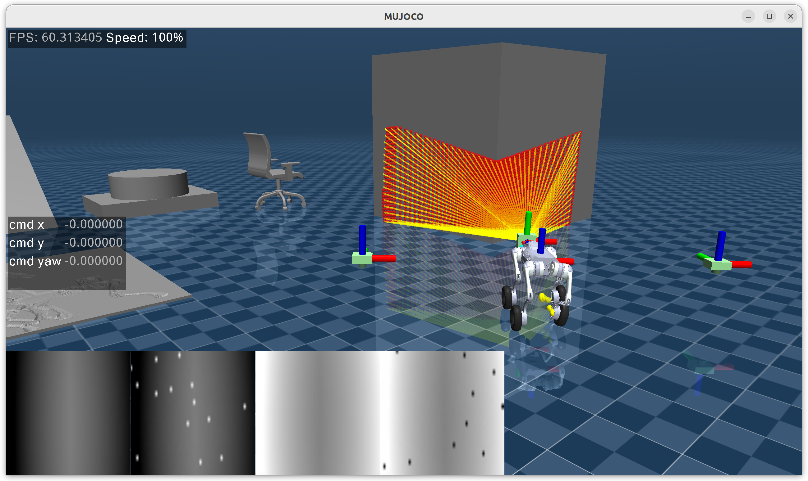

**Languages:**
[English](README.md) | [简体中文](README.zh-CN.md)

# Sensor RayCaster Plugins

A raycaster sensor plugin bound to camera, implemented based on mj_ray. The raycaster parameters closely match those of IsaacLab. The `raycaster_src` can be used directly with C++ API, [reference](https://github.com/Albusgive/go2w_sim2sim)

[📺 Video Demo](https://www.bilibili.com/video/BV1SSe1zLEVf/?spm_id_from=333.1387.homepage.video_card.click&vd_source=71e0e4952bb37bdc39eaabd9c08be754)
[🤖 Plugin Function Demo](https://www.bilibili.com/video/BV1wYnvzgExg/?spm_id_from=333.1387.homepage.video_card.click&vd_source=71e0e4952bb37bdc39eaabd9c08be754)

## sensors
mujoco.sensor.ray_caster


mujoco.sensor.ray_caster_camera


mujoco.sensor.ray_caster_lidar


# Build

Note: The cloned MuJoCo version must match the version you will use.

```
git clone https://github.com/google-deepmind/mujoco.git
cd mujoco/plugin
git clone https://github.com/Albusgive/mujoco_ray_caster.git
cd ..
```

Modify MuJoCo's CMakeLists.txt:
```cmake
add_subdirectory(plugin/elasticity)
add_subdirectory(plugin/actuator)
add_subdirectory(plugin/sensor)
add_subdirectory(plugin/sdf)
# New path
add_subdirectory(plugin/mujoco_ray_caster)
```

```
mkdir build
cd build
cmake ..
cmake --build . # For multi-threaded compilation, use cmake --build . -j<number_of_threads>
cd bin
mkdir mujoco_plugin
cp ../lib/*.so ./mujoco_plugin/
```

test1:
```
./simulate ../../plugin/mujoco_ray_caster/model/ray_caster.xml
```

test2:
```
./simulate ../../plugin/mujoco_ray_caster/model/ray_caster2.xml
```

# MJCF

## base config

### SensorData

**sensor_data_types: string list(n)**
Combines data patterns with underscores. Value is an array of strings of arbitrary length. These data will be concatenated in order to mjData.sensordata.

data_type:
- data: Distance in meters
- image: Image data [0, 255] of distance range. When noise is enabled, you can choose to read the source image and noise image
- normal: Normalized data [0, 1] of distance range. Same as above
- pos_w: Ray hit point in world coordinates. Returns NAN if no hit or out of range
- pos_b: Ray hit point in sensor coordinates. Returns NAN if no hit or out of range
- inv: Invert data
- inf_zero: Set data for undetected rays to 0. Default is inf_max when not enabled
- noise: Whether data includes noise
- distance_to_image_plane
- image_plane_image
- image_plane_normal

| cfg \ data_type | data | image | normal | distance_to_image_plane | image_plane_image | image_plane_normal | pos_w | pos_b |
|-----------------|------|-------|--------|-------------------------|-------------------|---------------------|-------|-------|
| inv             | ✘    | ✔     | ✔      | ✘                       | ✔                 | ✔                   | ✘     | ✘     |
| inf_zero        | ✔    | ✔     | ✔      | ✔                       | ✔                 | ✔                   | ✘     | ✘     |
| noise           | ✔    | ✔     | ✔      | ✔                       | ✔                 | ✔                   | ✘     | ✘     |

example:
```XML
<config key="sensor_data_types" value="data data_noise data_inf_zero inv_image_inf_zero noise_image pos_w pos_b normal inv_normal" />
```

**dis_range: real(6), "1 1 1 0 0 0"**
- Ranging distance

**geomgroup: real(6), "1 1 1 0 0 0"**
- Which geometry groups to detect

**detect_parentbody: real(1), "0"**
- Whether to detect the sensor's parent body

### VisVisualize

**draw_deep_ray: real(7), "1 5 0 1 0 0.5 1"**
- Draw rays: ratio width r g b a edge

**draw_deep_ray_ids: real(6+n), "1 5 1 1 0 0.5 list"**
- Draw rays with specified IDs: ratio width r g b a id_list

**draw_deep: real(6), "1 5 0 0 1 0.5"**
- Draw rays measuring depth: ratio width r g b a

**draw_hip_point: real(6), "1 0.02 1 0 0 0.5"**
- Draw ray hit points: ratio point_size r g b a

**draw_normal: real(6), "1 0.02 1 1 0 0.5"**
- Draw normals at ray hit points: ratio width r g b a

example:
```XML
<config key="draw_deep_ray" value="1 5 0 1 1 0.5 1" />
<config key="draw_deep_ray_ids" value="1 10 1 0 0 0.5 1 2 3 4 5 30" />
<config key="draw_deep" value="1 5 0 1 0" />
<config key="draw_hip_point" value="1 0.02" />
<config key="draw_normal" value="1 5 " />
```

### Noise

**noise_type: [uniform, gaussian, noise1, noise2]**
- Noise type

**noise_cfg: n**

| noise_type | noise_cfg |
|-----------|-----------|
| uniform   | low high seed |
| gaussian  | mean std seed |
| noise1    | low high zero_probability seed |
| noise2    | low high zero_probability min_angle max_angle low_probability high_probability seed |

#### noise1
Adds random zero values on top of mean noise

#### noise2
noise2 is noise based on approximate ray incident angles. On top of noise1, from minimum incident angle to maximum incident angle [90, 180], the probability of data being 0 is [low_probability, high_probability]

<div align="center">








</div>

### Other

**compute_time_log: real(1), "0"**
- Print computation time

**n_step_update: real(1), "1"**
- Update every n_step

**num_thread: real(1), "0"**
- Add n threads for ray computation to improve performance. When using this parameter with many threads, you may need to restart the program each time

**lossangle: real(1), "0"**
- Angle difference between the vector from hit point to camera and the normal vector. Rays are lost when the angle exceeds this value. Unit: degrees, range (0, 180)
- Note: This feature requires mujoco >= 3.4.1

As shown below: The left image has lossangle enabled, the right image shows a normal camera. See [ray_caster3.xml](./model/ray_caster3.xml) for demonstration.

<div align="center">


</div>

## RayCaster

**resolution: real(1), "0"**
- Resolution

**size: real(2), "0 0"**
- Size in meters

**type: [base, yaw, world]"**
- base: Camera lookat in self-coordinate system
- yaw: Yaw in self-coordinate system, world z downward
- world: World coordinate system, z downward

## RayCasterCamera

**focal_length: real(1), "0"**
- Focal length in cm

**horizontal_aperture: real(1), "0"**
- Image horizontal size in cm

**vertical_aperture: real(1), "0"**
- Image vertical size in cm

**size: real(2), "0 0"**
- h_ray_num, v_ray_num

**baseline: real(1), "0"**
- If using a binocular depth camera, you need to set baseline, which is the distance between two cameras. This can reproduce the ghosting and edge shadow phenomena of real binocular depth cameras.

<div align="center">


</div>

**lossangle: real(1), "0"**
- Extension of the original lossangle for binocular depth cameras
- The angle difference between the light path normal reflected from LDM to stereo_camera and the object surface normal

## RayCasterLidar

**fov_h: real(1), "0"**
- fov_h in degrees

**fov_v: real(1), "0"**
- fov_v in degrees

**size: real(2), "0 0"**
- h_ray_num, v_ray_num

# GetData

Demo provides reading examples.
All data is in mjData.sensordata.
Data info is stored in mjData.plugin_state.
h_ray_num, v_ray_num, list[data_point, data_size]
data_point is the data position relative to the total data of this sensor.

example:

**C++:**
```C++
std::tuple<int, int, std::vector<std::pair<int, int>>>
get_ray_caster_info(const mjModel *model, mjData *d,
                    const std::string &sensor_name) {
  std::vector<std::pair<int, int>> data_ps;
  int sensor_id = mj_name2id(m, mjOBJ_SENSOR, sensor_name.c_str());
  if (sensor_id == -1) {
    std::cout << "no found sensor" << std::endl;
    return std::make_tuple(0, 0, data_ps);
  }
  int sensor_plugin_id = m->sensor_plugin[sensor_id];
  int state_idx = m->plugin_stateadr[sensor_plugin_id];

  for (int i = state_idx + 2;
       i < state_idx + m->plugin_statenum[sensor_plugin_id]; i += 2) {
    data_ps.emplace_back(d->plugin_state[i], d->plugin_state[i + 1]);
  }
  int h_ray_num = d->plugin_state[state_idx + 0];
  int v_ray_num = d->plugin_state[state_idx + 1];
  return std::make_tuple(h_ray_num, v_ray_num, data_ps);
}
```

**Python:**
```Python
def get_ray_caster_info(model: mujoco.MjModel, data: mujoco.MjData, sensor_name: str):
    data_ps = []
    sensor_id = mujoco.mj_name2id(model, mujoco.mjtObj.mjOBJ_SENSOR, sensor_name)
    if sensor_id == -1:
        print("Sensor not found")
        return 0, 0, data_ps
    sensor_plugin_id = model.sensor_plugin[sensor_id]
    state_idx = model.plugin_stateadr[sensor_plugin_id]
    state_num = model.plugin_statenum[sensor_plugin_id]
    for i in range(state_idx + 2, state_idx + state_num, 2):
        if i + 1 < len(data.plugin_state):
            data_ps.append((int(data.plugin_state[i]), int(data.plugin_state[i + 1])))
    h_ray_num = (
        int(data.plugin_state[state_idx]) if state_idx < len(data.plugin_state) else 0
    )
    v_ray_num = (
        int(data.plugin_state[state_idx + 1])
        if state_idx + 1 < len(data.plugin_state)
        else 0
    )
    return h_ray_num, v_ray_num, data_ps
```

# Demo

## C++
```
cd demo/C++
mkdir build
cd build
cmake ..
make
./sensor_data
```

## Python
```
cd demo/Python
python3 sensor_data_viewer.py
python3 view_launch.py
```

## ROS2

Note: Need to install cyclonedds-cpp. Using fastdds may cause bugs.

```
sudo apt update
sudo apt install ros-<distro>-rmw-cyclonedds-cpp
export RMW_IMPLEMENTATION=rmw_cyclonedds_cpp
```

### C++ & cmake
```
cd demo/ROS2/C++
mkdir build
cd build
cmake ..
make
./sensor_data
```

### C++ & colcon
```
cd demo/ROS2/colcon
colcon build
source install/setup.bash
ros2 run ray_caster sensor_data
```

# Technical Discussion

